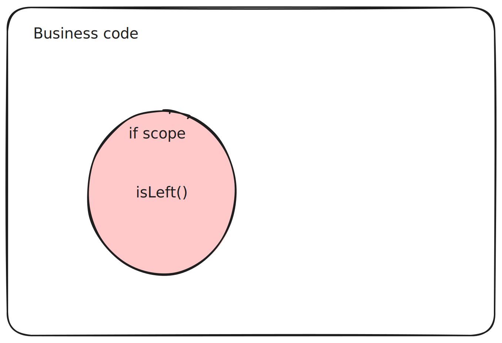
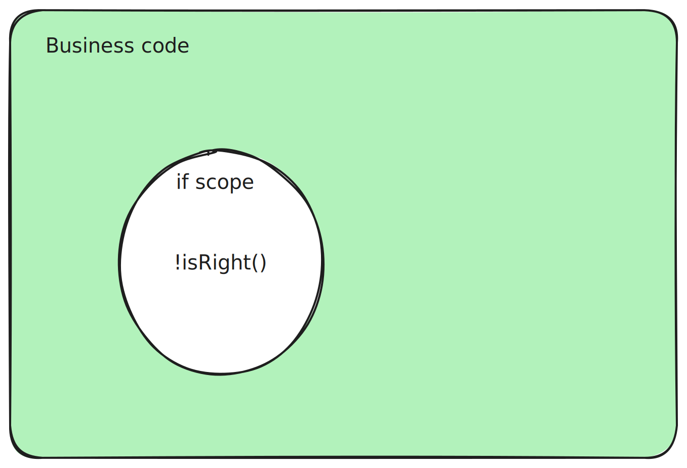

# 타입스크립트에서 타입이 내 의도대로 추론되지 않았던 경험
비즈니스 로직에서 어떠한 값을 조회 후, 해당 값이 존재하지 않는다면 로직을 더 이상 진행 할 수 없어 종료해야 할 수 있다. 이 때 아직 진행 해야 할 로직이 많은 상태에서 여러 실패의 경우를 미리 판단하기 위해 if문을 써서 빠른 리턴 패턴을 쓸 수 있다. <br />
아래의 코드 중 businessLogic2의 early return 패턴을 사용하는 코드를 개인적으로 선호 하는데 최근에는 타입 추론이 의도대로 되지 않았던 일이 있어 관련하여 적어볼까 한다.
```ts
function businessLogic1() {
  if (/** 긍정 조건 */) {
    // 비즈 니스 로직 수행
    return;
  }

  /** 오류에 대한 처리 */
}

function businessLogic2() {
  if (/** 오류 판단 */) {
    return;
  }

  // 비즈니스 로직 수행
}
```

예상이 빗나간 추론을 예시로 살펴보자
```ts
/**
 * 나누기 함수는 n/d의 결과를 반환하는데 0으로는 나눌 수 없으니 
 * d가 0일 때는 오류를 반환하는 함수가 있다
*/
function div(n: number, d: number): Either<Error, number>;

function businessLogic(n: number, d: number) {
  const num = div(n, d);

  if (num.isLeft()) {
    // 오류이기 때문에 로직 종료
    return;
  }

  // 위의 if에서 오류일 경우를 걸렀기 때문에 아래의 num값은 성공을 반환한 number일거라 예측
  num.getValue() * 10;
}
```
위 예시대로 작동하리라 생각했지만 vscode에서는 타입 오류를 나타내는 에러가 발생하고 있었다. 왜인지 살펴보니 if문 아래의 num값이 number로 추론되지 않고 Error | number의 타입이라 곱연산을 할 수 없다는 것이었다.

if 조건문의 추론 범위는 `if {}`의 스코프 내에서만 유효하였다. if문의 스코프 내에서만 num값이 Error로 추론되고 return을 통한 로직의 종료를 나타내어도 if문 바깥에서는 num은 원본인 Error | number의 타입을 가지고 있다.

이제 내가 의도한대로 하게 하려면 어떻게 해야 할까?
```ts
function businessLogic(n: number, d: number) {
  const num = div(n, d);

  if (num.isRight()) {
    // 정상 로직을 위에서 수행?
    return;
  }
}
```
걸러야 할 오류 조건이 많지 않다면 위 코드대로 해도 되겠지만 비즈니스 로직이 복잡해지면 판단해야 할 오류 조건이 여러개로 늘어나고 그땐 오히려 중첩 if문 코드가 늘어날 수 있다.

결국 최종적으로 사용한 코드는 아래와 같다
```ts
function businessLogic(n: number, d: number) {
  const num = div(n, d);

  if (!num.isRight()) {
    // 오류이기 때문에 로직 종료
    return;
  }

  num.getValue() * 10;
}
```
위의 코드는 num.isRight()에 부정 연산자를 사용하여 if 내부는 num의 상태를 num.isLeft()의 반대로 Error | number 타입으로 추론하고 if {} 스코프 외는 num을 number로 인식하게 된다. Error 상태일 때 별다른 연산을 할 일은 없으니 Error | number로 추론하여도 관계가 없고 if문 바깥에서는 연산 하기가 쉬워진다.

결론은 num.isLeft()와 !num.isRight()의 차이는 아래 같은 느낌이다. 색이 칠해진 곳만 타입이 좁혀진다. 


